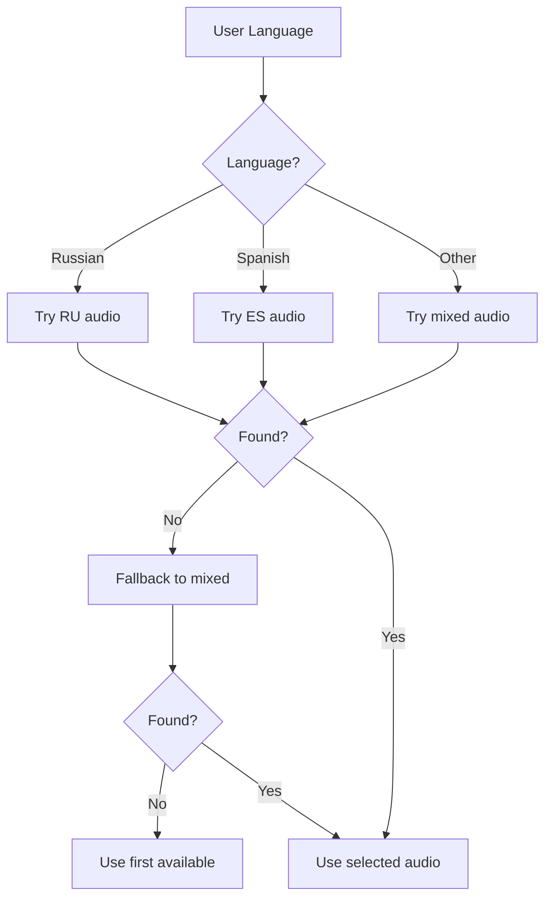
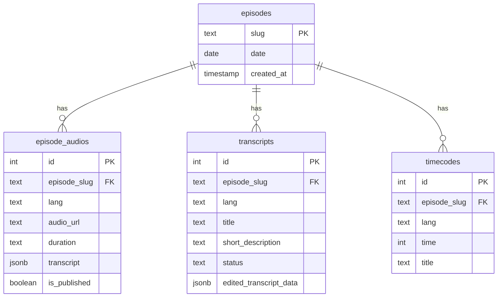

# Audio Import and Processing Plan

## Overview

This plan outlines the process for importing new podcast episodes from the Peru/Audio folder, including creating episode records, processing transcripts, and generating questions.

## Current Understanding

### File Naming Convention

| Pattern | Example | Description |
|---------|---------|-------------|
| `YYYY-MM-DD.mp3` | `2025-12-10.mp3` | Main mixed file (both languages) |
| `YYYY-MM-DD_ES.mp3` | `2025-12-10_ES.mp3` | Spanish track from lapel mic |
| `YYYY-MM-DD_RU.mp3` | `2025-12-10_RU.mp3` | Russian track from lapel mic |
| `YYYY-MM-DD_name.mp3` | `2025-12-31_ano_nuevo.mp3` | Named episode with custom slug |
| `YYYY-MM-DD_LANG.json` | `2025-12-10_ES.json` | AssemblyAI transcript |

### Audio Language Logic



### Database Schema



### AssemblyAI JSON Structure

The raw JSON from AssemblyAI contains:
- `id` - AssemblyAI transcript ID
- `status` - Processing status
- `text` - Full transcript text
- `words` - Array with: `text`, `start`, `end`, `confidence`, `speaker`

### Required Transformations

The transcript needs to be converted to utterances format:

```json
{
  "utterances": [
    {
      "id": 0,
      "start": 41850,
      "end": 45530,
      "text": "Claquetera, sí, se llama claquetero.",
      "speaker": "A"
    }
  ],
  "text": "Full transcript text..."
}
```

## Files to Process

| Date | ES Audio | RU Audio | Mixed Audio | ES JSON | RU JSON |
|------|----------|----------|-------------|---------|---------|
| 2025-12-10 | ✅ | ✅ | ✅ | ✅ | ✅ |
| 2025-12-24 | ✅ | ✅ | ✅ | ✅ | ✅ |
| 2025-12-31 | ✅ | ✅ | ✅ | ✅ | ✅ |
| 2026-01-28 | ❌ | ❌ | ✅ | ✅ | ✅ |
| 2026-02-04 | ✅ | ✅ | ✅ | ✅ | ✅ |
| 2026-02-11 | ✅ | ✅ | ✅ | ✅ | ✅ |

## Implementation Steps

### Step 1: Create Episodes in Database

For each unique episode slug:
1. Check if episode already exists in `episodes` table
2. If not, create new episode with:
   - `slug`: from filename (e.g., `2025-12-10` or `2025-12-31_ano_nuevo`)
   - `date`: extracted from filename (YYYY-MM-DD part)

### Step 2: Create Audio Records

For each audio file:
1. Parse filename to get slug and language
2. Create record in `episode_audios`:
   - `episode_slug`: from filename
   - `lang`: `es`, `ru`, or `mixed`
   - `audio_url`: `https://silver-lemur-512881.hostingersite.com/wp-content/uploads/Audio/{filename}`

### Step 3: Process Transcripts

For each JSON file:
1. Read AssemblyAI JSON
2. Convert `words` array to `utterances`:
   - Group consecutive words by speaker
   - Create utterance objects with `id`, `start`, `end`, `text`, `speaker`
3. Create compact transcript data
4. Upsert to `transcripts` table:
   - `episode_slug`: from filename
   - `lang`: `es` or `ru`
   - `edited_transcript_data`: transformed transcript

### Step 4: Generate Questions

For each transcript:
1. Check if timecodes already exist
2. If not, use DeepSeek to analyze transcript
3. Extract questions/topics with timestamps
4. Insert into `timecodes` table

## Technical Details

### Audio URL Format

```
https://silver-lemur-512881.hostingersite.com/wp-content/uploads/Audio/{filename}
```

### Language Code Mapping

| Filename Suffix | Language Code | Notes |
|-----------------|---------------|-------|
| `_ES.mp3` | `es` | Spanish lapel mic |
| `_RU.mp3` | `ru` | Russian lapel mic |
| `.mp3` (no suffix) | `mixed` | Combined audio |

### Transcript Processing Rules

1. **Segment Duration**: Group words into utterances by speaker
2. **Speaker Mapping**: AssemblyAI uses A, B, C... → convert to 0, 1, 2...
3. **Time Format**: Keep in milliseconds (from AssemblyAI)
4. **Text Cleaning**: Preserve original text, no additional processing

### Questions Generation

Using DeepSeek API with specialized prompt:
- Identify questions from listeners
- Find meditation/relaxation segments
- Extract timestamps and create titles
- Language: Match transcript language (ES or RU)

## Script Structure

```
scripts/
├── import-new-episodes.cjs    # Main import script
├── process-transcripts.cjs     # Transcript transformation
└── generate-questions.js       # Question generation (exists)
```

## Execution Order

1. Run episode creation script
2. Run transcript processing script
3. Run question generation script
4. Verify in database

## Questions for Clarification

1. **Episode Titles**: Should we auto-generate titles like "Meditación 10.12.2025" or use a different format?
2. **Descriptions**: Do we need to generate short descriptions for episodes?
3. **Publishing**: Should new episodes be auto-published (`is_published: true`)?
4. **Existing Data**: Should we skip existing episodes or update them?

## Next Steps

After approval:
1. Create the import script
2. Test with one episode
3. Process remaining episodes
4. Generate questions
5. Verify in the application
